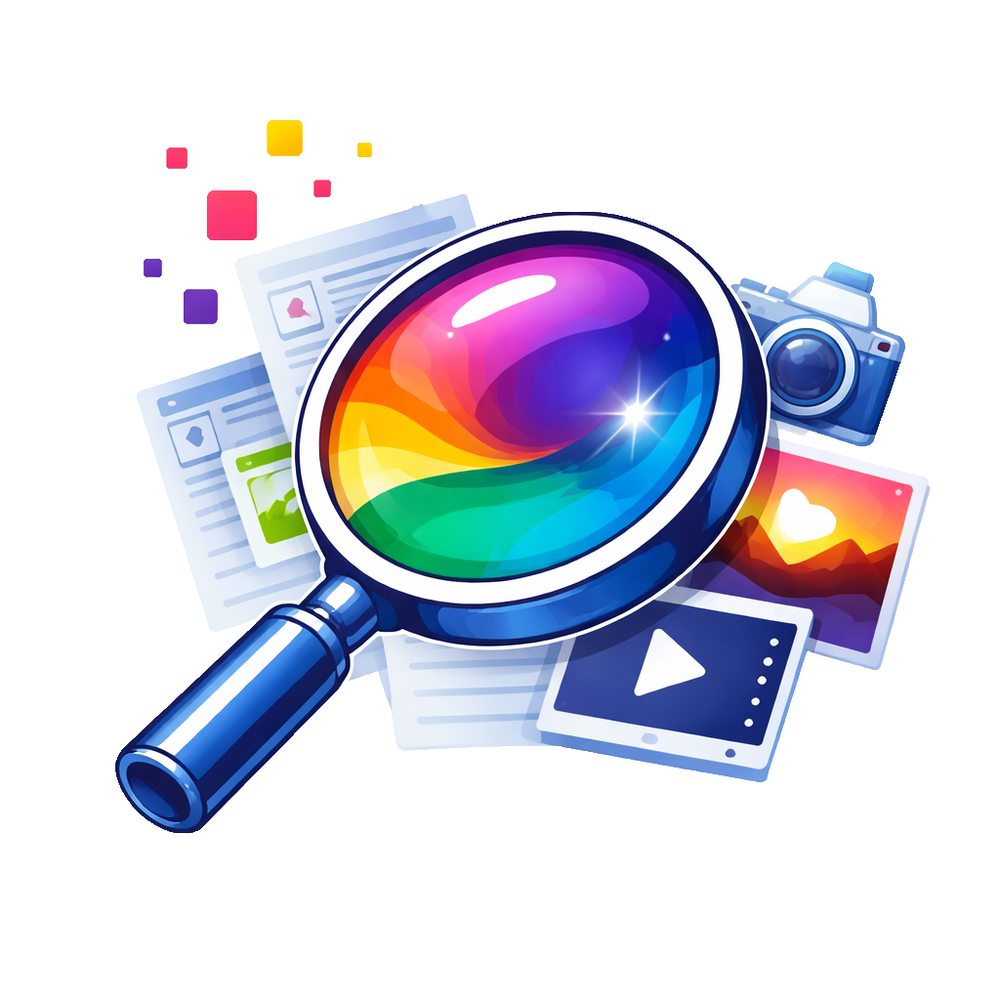
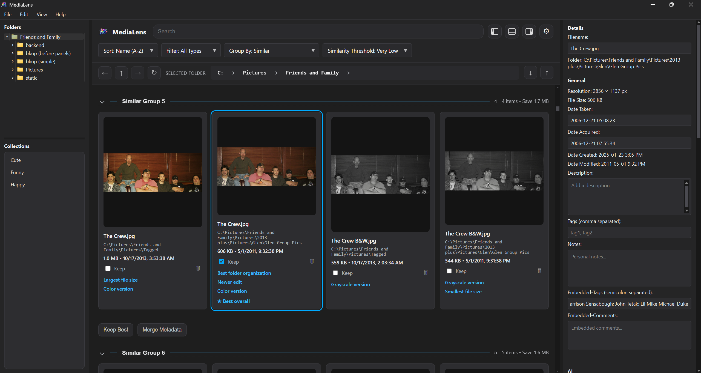
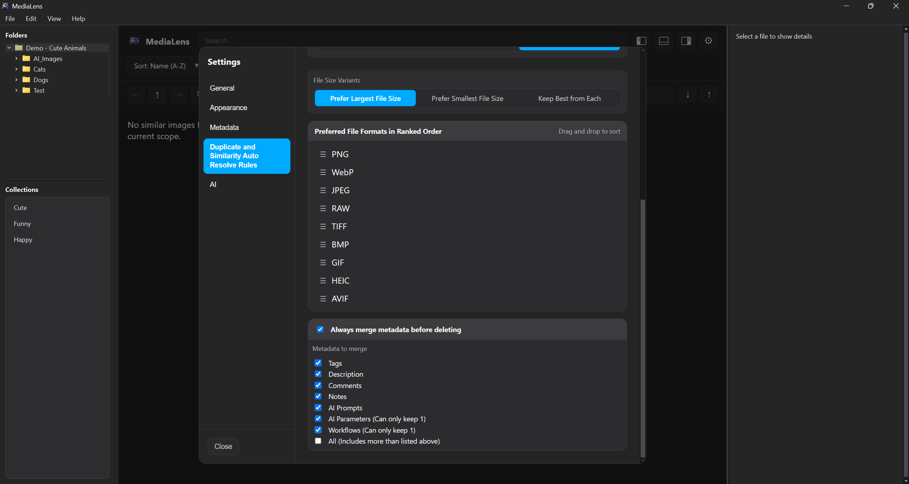
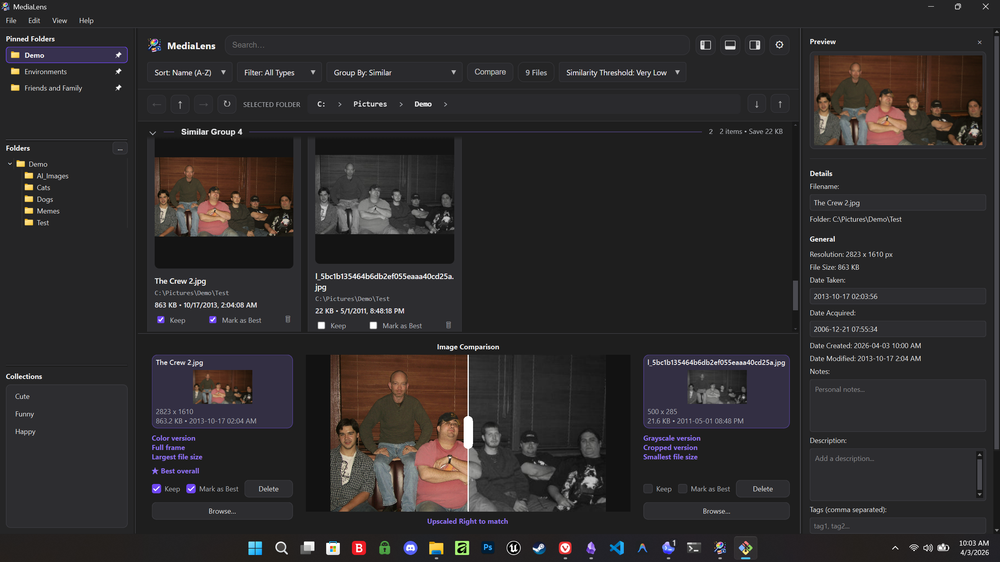
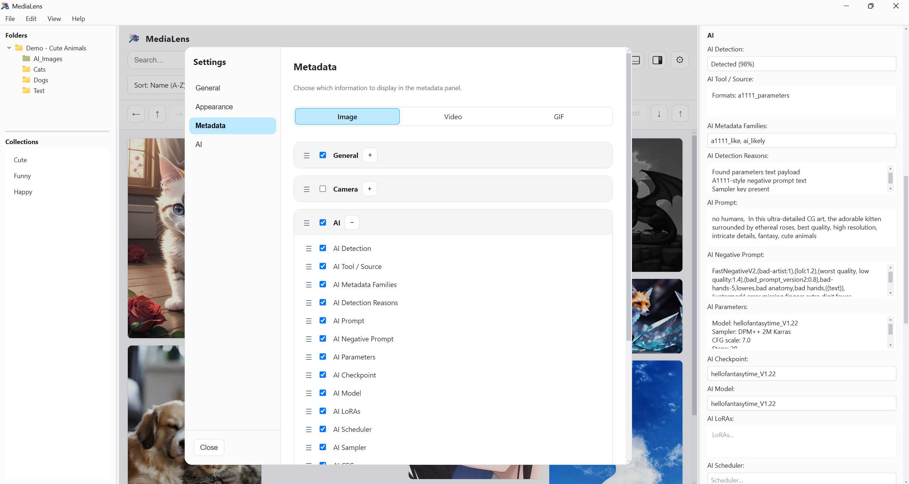
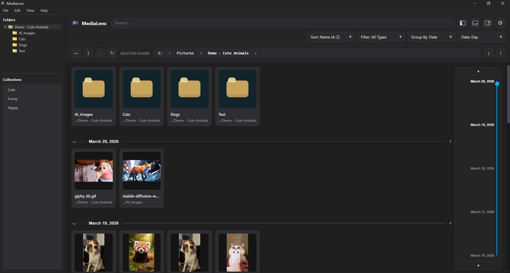
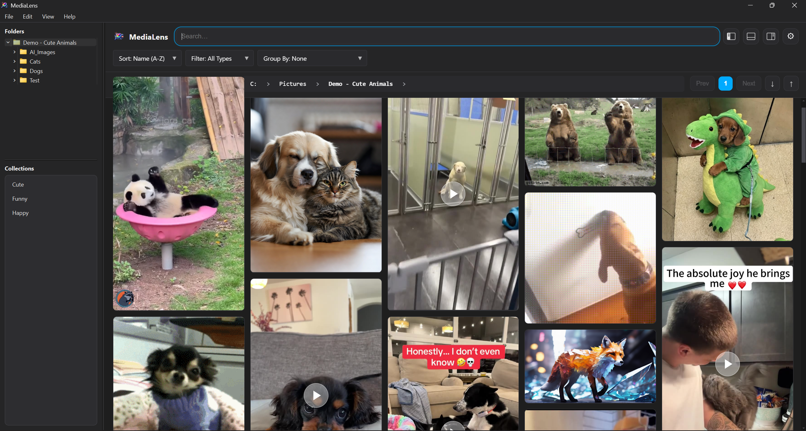

# MediaLens



**MediaLens helps you clean up duplicate and similar images with confidence—by showing exactly how files differ and which one to keep.**

If you’ve ever tried to clean up duplicates and:

- Didn’t know which version to keep
- Ended up with multiple slightly different edits
- Or avoided deleting anything because you might lose the best one

MediaLens is built for exactly that.

Instead of just showing duplicates, MediaLens breaks down how files differ—size, resolution, edits, format, and more—then helps you make the right decision with confidence.

Built to be safe and transparent—MediaLens never deletes files blindly and always shows exactly why one file is preferred over another.

---

### Why not just use a duplicate cleaner?

Most tools show you duplicates.

MediaLens shows you what actually changed—and helps you choose the best version without guessing.

---

## More than just duplicate cleanup

Once your library is under control, MediaLens helps you:

- Organize and group files beyond folders using collections and metadata
- Instantly find files by what they contain, how they were created, or when they were made
- Extract hidden data like AI prompts, EXIF, and embedded comments
- Navigate large libraries without slowing down

---

## Built For

MediaLens is built for anyone dealing with duplicate-heavy or complex image libraries—especially where variations, edits, or AI-generated images make it hard to know what to keep.

- AI image/video generators
- Photographers with large photo archives
- Video editors and content creators
- Researchers building datasets or tagging systems
- Power users who want control over their files

---

## What Makes MediaLens Different?

- Unlike traditional duplicate cleaners, MediaLens doesn’t just detect duplicates — it explains their differences and helps you make the right decision.
- No blind cleanup — **Transparent explanations for why files are similar and which to keep**
- Define rules for automatic cleanup based on what matters most to you.
- Instead of guessing, you see exactly what changed—resolution, edits, format, text, color, and more—so you can make the right call instantly.
- Go beyond surface-level metadata to find embedded AI prompts and even full generation workflows hidden inside your files
- Collections go beyond traditional folders, letting you organize files based on metadata instead of location.

---

### What it feels like

1. Scan your library
2. See duplicates grouped instantly
3. Open comparison and inspect differences
4. Choose the best version (or let MediaLens suggest one)
5. Optionally tell MediaLens what matters most to you or stick with recommended settings
6. Clean up safely and move on

No guesswork. No accidental deletes. No digging through folders.

---

## Key Features

### Intelligent Duplicate & Similarity Detection

MediaLens doesn’t just find identical files — it understands variations.

#### Detect

- Exact duplicates (content hash)
- Visually similar images (perceptual hashing)
- Resized, compressed, and edited variants
- Color vs grayscale versions
- Cropped vs full compositions
- Text or watermark added/removed

#### Understand

Each group is analyzed and labeled with meaningful differences:

- Largest / smallest file size
- Highest resolution
- Preferred file format
- Color vs grayscale
- Cropped vs full composition
- Metadata richness
- Folder organization
- Text detection

#### Decide (or let MediaLens decide for you)

- ★ Best overall recommendation based on configurable priorities
- Keep-best selection per group
- Non-destructive metadata merging
- Auto-resolve with flexible rules



#### Stay in control

- Configure ranking priorities (what “best” means to you)
- Define variant rules (prefer this / prefer that / keep both)
- Safely review before deleting
- Never deletes files blindly — decisions are always explainable and reviewable
- Designed to prevent destructive mistakes in large libraries



---

### Image Comparison

Evaluate two images in place without leaving your workflow.

- Side-by-side slots with a central **reveal slider** for precise visual comparison
- Drag-and-drop, browse, or right-click actions like `Compare Images` and `Compare With Left/Right`
- Synchronized zoom and pan keep both images perfectly aligned during inspection
- Hold-to-isolate preview lets you instantly focus on one image at a time
- Reuses similarity card design for a consistent, familiar experience

#### Smarter decisions, not just visual checks

- Labels are recalculated for the current two-image comparison (not reused from larger groups)
- Highlights meaningful differences like:
  - Largest vs smallest file
  - Newer vs older edit
  - Color vs grayscale
  - Cropped vs full composition
- ★ Best overall recommendation adapts to the current comparison context

#### Built into your cleanup workflow

- Keep, Mark as Best, and Delete actions work seamlessly with existing duplicate resolution
- Compare → decide → clean up without switching tools or losing context



---

### Advanced Metadata System

Go beyond filenames, and even beyond traditional metadata.

#### Extract

- AI prompts & generation parameters
- EXIF & camera data
- Embedded comments and tags

#### Choose your workflow

- Fast local database
- Embedded metadata in files
- Edit metadata in bulk across files or folders
- Persistent tagging via file hashing (even after moving/renaming files)

  

---

### Timeline-Based Browsing

Explore your media by **when it was created, modified, acquired, taken, or automatically determined**.

- Group by **day, month, or year**
- Smooth timeline scrubbing with live feedback
- Active / visible context highlighting
- Infinite scrolling for continuous browsing
- Jump through large libraries instantly

This transforms browsing from "where is it?" to **"when did I make it?"**

  

---

### High-Performance Gallery

- Smooth browsing for images, GIFs, and videos
- Infinite scroll where it matters
- Lightbox for focused, full-size viewing

#### Multiple view modes

- Masonry
- Grid (various sizes)
- List / Details / Content views

---

### Smart Organization

- Search, filter, and sort your entire library
- Collections for flexible grouping (independent of folders)
- Drag-and-drop between folders directly in the gallery, file tree, or explorer
- Clean, responsive UI designed for real work sessions

---

### Built for Large Libraries

- Lazy loading and optimized scanning
- Hybrid pagination + infinite scroll strategy
- Timeline-aware navigation at scale
- Designed to handle **thousands of files without breaking flow**

---

### Clean, Stable UI

- Dark and light themes with accent color of your choice
- Responsive layout that adapts to screen size
- Optimized rendering for multiple animated GIFs and videos in a collage-style masonry view with no stutter, lag, or flicker
- Carefully tuned interactions for smooth, predictable behavior

---

### Masonry View

Masonry view gallery feels like a multi-media collage, able to play multiple animated gifs and videos in place with no wasted space or lag.



---

## Getting Started

### Recommended (Windows)

Download the latest installer:

<https://github.com/G1enB1and/MediaLens/releases>

- One-click setup
- All dependencies included
- Desktop shortcut created automatically

---

## Power Users (Run from Source)

```powershell

git clone https://github.com/G1enB1and/MediaLens.git
cd MediaLens
python -m venv .venv
.\.venv\Scripts\Activate.ps1
python -m pip install -U pip
python -m pip install -e .
python scripts\setup.py
python run.py

```

---

## Roadmap

MediaLens is evolving into a full intelligent media platform.

### Near-Term

- Advanced search UI via expandable menu options
- Batch rename engine
- Improved metadata automation and syncing

---

### AI-Powered Features

- Auto-tagging and image descriptions
- Prompt extraction and management
- Prompt library and workflow tools
- "Chat with your images" (vision + LLM integration)
- Segment Anything (SAM) integration
- AI-assisted similarity validation for edge cases

---

### Ecosystem & Sync

- Google Photos / Drive import
- OneDrive / Dropbox / cloud integrations
- Cross-device sync options
- Local-first + private cloud (NAS / Docker support)

---

### Advanced Tools

- Facial recognition and grouping
- Dataset creation tools (AI training workflows)
- Bulk metadata generation and export
- Media analysis and filtering tools

---

## License

MIT License

---

Created by Glen Bland
