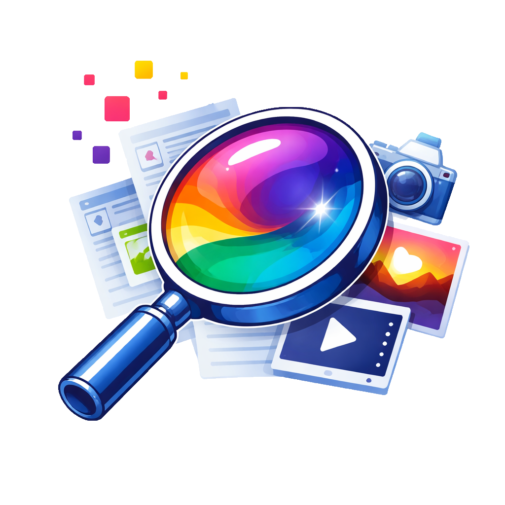

# MediaLens

**MediaLens helps you clean up duplicate and similar images with confidence, then becomes the fastest way to explore, understand, and organize your entire media library.**

If you’ve ever:

- Didn’t know which version to keep
- Ended up with multiple slightly different edits
- Struggled to find anything later

MediaLens is built for that entire experience, not just detection, but decision and long-term organization.

---

## Why MediaLens?

Most duplicate finders focus on deletion.

Most media managers focus on storage.

**MediaLens focuses on understanding your library.**

- Explainable cleanup decisions 
- See differences like resolution, edits, format, text, and more
- Get clear “best version” recommendations based on your rules
- AI metadata extraction  
- OCR searchability  
- Facial recognition  
- Bulk metadata workflows  
- Timeline browsing  
- Local-first AI
- Review safely before anything is removed
- Rest easy with file retention and undoable action history 

No guesswork. No blind deletes.

---

## What it becomes after cleanup

Once your library is clean, MediaLens becomes your daily workspace:

- Fast search, filtering, ratings, and tagging  
- Collections, Smart Collections, and folder-backed collections  
- Facial recognition and People browsing  
- Bulk editing and bulk renaming  
- OCR and AI-powered metadata extraction  
- Timeline browsing by when things happened  
- Deep metadata, prompts, workflows, and AI detection

---

## Built For

- AI image/video creators
- Photographers with large archives
- Video editors and content creators
- Dataset builders and researchers
- Anyone with messy, duplicate-heavy libraries

---

## Key Features

### Intelligent Duplicate & Similarity Cleanup

MediaLens doesn’t just detect duplicates, it understands variations.

#### Detect

- Exact duplicates (content hash)
- Visually similar images (perceptual hashing)
- Edited, resized, compressed variants
- Crops, grayscale, watermark/text changes

#### Understand

Each group is labeled with meaningful differences:

- Resolution, size, format
- Cropped vs full
- Text detected
- Metadata richness
- Folder priority

### Decide

- ★ Best overall recommendation
- Configurable rules for what “best” means
- Auto-resolve entire libraries safely
- Metadata merge before deletion

Always transparent. Always reversible.

---

### Image Comparison

Evaluate two images without leaving your workflow.

- Side-by-side with reveal slider
- Synchronized zoom and pan
- “Best in comparison” suggestions
- Integrated keep/delete actions

Compare → decide → clean up.

---

### Bulk Editing Workspace

Tags, descriptions, OCR, and Rename all in one place.

#### Tags

- Bulk edit across hundreds of files
- Common vs uncommon tag detection
- Tag lists with one-click apply

#### Descriptions

- Edit or generate captions in bulk
- AI-assisted descriptions (local models)

#### Text OCR (Fast + AI)

- Extract text from images and video previews
- Choose:
    - Fast OCR (quick)
    - AI OCR (higher accuracy)
- Mark files as “No Text”
- Save and edit results directly

---

#### OCR Review

- Large preview with zoom + pan
- Compare Fast OCR vs AI OCR vs your edits
- Confirm best result per file
- Navigate quickly across files

---

#### Bulk Rename Editor

Rename hundreds or thousands of files with custom rules.  
  
- Live preview table before applying changes  
- Prefix and suffix tools  
- Numbering sequences with custom padding and start
- Case conversion  
- Metadata-driven naming  
- Support for renaming sidecar files in matching groups such as txt files with captions that match image files -  very useful for training datasets
- Sanitation options to make file names safer across all operating systems
- Undo support through Action History  
  
Preview exactly what will happen before making changes.

---

### Bulk Metadata Editor

Update metadata across hundreds of files at once.

- Bulk ratings
- Bulk collections
- bulk people
- Configurable metadata fields
- Per-file and batch editing workflows

---

### Built-in AI (Local & Private)

MediaLens includes optional **local AI models** to help organize your media without sending your files to the cloud.

- Generate tags automatically
- Generate descriptions
- High-accuracy OCR
- Works with AI-generated images

#### Designed for control

- Models install on demand
- Run locally (GPU or CPU)
- Never overwrite your data without permission

---

### People & Facial Recognition  
  
Find and organize photos by the people who appear in them.  
  
- Local facial detection and recognition  
- Automatic grouping of similar faces  
- Name people and browse their photos  
- Review face crops, landmarks, and profile images  
- Open person-based search results instantly  
- Fully local processing using optional InsightFace models  
  
Perfect for family photos, event photography, and large personal archives.

---

### Advanced Search

Find exactly what you're looking for without memorizing syntax.

- Visual query builder
- Combine tags, metadata, text, dates
- Save searches
- Sync between UI and raw search

---

### Metadata System

Go beyond filenames.

- Extract:
    - AI prompts & workflows
    - EXIF / camera data
    - Embedded metadata
- Edit metadata in bulk
- Persistent tagging via file hashing
- Works even if files move or rename

---

### AI Detection & Metadata  
  
Identify AI-generated content automatically.  
  
- Detect AI-generated images from embedded metadata  
- Extract prompts and workflows  
- Identify generation tools and models  
- Manual AI / Non-AI overrides  
- Search and filter by AI status  
- Works alongside OCR, tags, descriptions, and ratings

---

### Ratings & Curation  
  
Quickly identify your best content.  
  
- 1–5 star rating system  
- Filter by rating  
- Sort by rating  
- Bulk rating updates  
- Combine ratings with tags, collections, and search  
  
Perfect for selecting portfolio images, favorites, and keeper shots.

---

### Timeline Browsing

Explore your media by **when**, not just where.

- Group by day, month, year
- Smooth timeline scrubbing
- Jump instantly across large libraries

---

### Automated Scanning

Keep your library up to date automatically.

- Scheduled scans (hourly, daily, weekly, or monthly)
- Folder-based monitoring
- Background processing
- Resume interrupted scans

---

### Backup & Restore

Your library is safe and portable.

- Export full library backups
- Restore fully or partially
- Merge or replace:
    - Metadata backups
    - Thumbnails and cache backups
    - AI model backups
    - App data and settings backups
    - OCR data backups
    - People Identification backups
    - Retention system backups

Includes automatic safety backups before restore.

---

### High-Performance Gallery

- Smooth browsing of images, GIFs, and videos
- Masonry, grid, and list views
- Infinite scroll where it matters
- Lightbox with zoom + pan

Built for thousands of files without slowing down.

---

### Collections & Smart Collections  
  
Organize files beyond folders.  
  
- Traditional collections  
- Folder-backed live collections  
- Smart collections based on rules  
- Recent files  
- Missing tags  
- Missing descriptions  
- Large files  
- AI-generated files  
- Text-detected files  
  
Create dynamic views without moving files.

---

### Folder-Based Collections & Drag-Drop Organization

- Folder drag-and-drop
- Explorer integration
- Collection sources
- Live folder collections
- Pinned folders
- Nested file controls

---

### Action History  
  
Review and recover changes with confidence.  
  
- Persistent Action History across sessions  
- Undo and Redo support  
- Recover deletes, moves, copies, renames, metadata edits, rotations, and more  
- Group actions and individual file actions  
- Clear status indicators showing what can and cannot be undone  
- Search and filter history entries  
  
MediaLens is designed so actions remain recoverable whenever possible.

---

## Getting Started

### Windows Installer

Download the latest release:

[https://github.com/G1enB1and/MediaLens/releases](https://github.com/G1enB1and/MediaLens/releases)

- One-click install
- All dependencies included
- Ready to go

---

## Roadmap

MediaLens is evolving into a full intelligent media platform.

### Near-Term

- Expanded filters (photo vs illustration, screenshots, people, etc.)
- Automatically label images with faces looking toward camera and smiling to help determine best image out of similar image groupings

### AI

- Prompt library tools
- “Chat with your images”
- Advanced similarity validation
- Segment Anything
- AI Powered Image Editing
- In-Painting / Out-Painting

### Built-In Editor
- Crop, resize, rotate
- Add / remove text
- Work in layers
- Apply filters such as color grading 
- Apply effects such as blur
- Segment anything
- Remove background
- In-Paint / Out-Paint
- AI built in for easier editing by text, selection by SAM, Expand by Outpainting, etc.

### Ecosystem

- Cloud integrations (Drive, OneDrive, etc.)
- Cross-device sync
- Local-first sync options

### Advanced Tools

- Dataset creation workflows

---

## License

MediaLens is source-available under the Business Source License (BSL) 1.1.

You may view, modify, and use the software for personal and non-commercial purposes, but commercial redistribution or resale is restricted.

See LICENSE for full details.

---

Created by Glen Bland